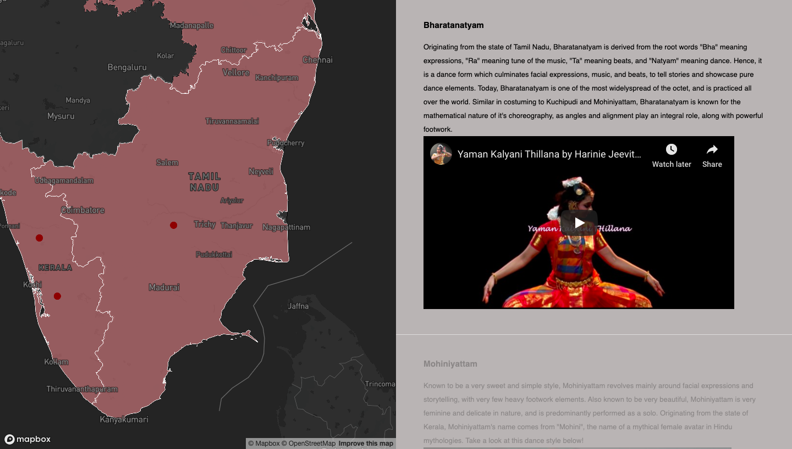

# The Classical Dance Forms of India 

Map Link: https://grihalakshmi.github.io/Grihalakshmi_Lab2/Grihalakshmi_Lab2.html

Screenshot: My favourite of the 8 dance forms! 

Reflective Analysis: (Please note, I've included a text file that contains the text of the actual story map and it's respective sources. The reflective analysis below is separate) 

Art rarely comes without a story behind it. Whether it be a painting, a piece of music, a poem, or a choreography, stories can create the backbone to what is being presented. Indian classical dance is no exception. Carrying a rich heritage and deep rooted values and culture, the story of Indian classical dance is something that I have wanted to tell for ages. As a dancer myself, I didn't want to leave my undergraduate degree at UBC without bringing my two passions together: dance and mapping. I felt that the story of India's classical dance forms is for the masses - a story that needed to be heard, and a story that I fell in love with at such a young age, when I started my dance training. I wanted this map to be for anyone and everyone who was remotely interested in learning about the topic, no matter how much background knowledge they had. Therefore, these two vastly different worlds of dance and mapping collided, I thought about how to weave them together in a manner that is seamless, provides clarity, and conveys the story of classical dance in a rightful manner. 

That is when I remembered story maps, a concept that I had learned in previous GIS courses. Upon my first Google search of story maps, I came across ESRI's story map concepts and saw how stunning and thoughtful the maps were. I loved the way that with just a scroll, the map could take the user on a journey through geographical regions, and that each region was accompanied by some form of text or media, to add significance to that location - more significance than just a marker label could add. Because of how widely spread the 8 classical dance forms are, and due to how much their geographic locations adds uniqueness and meaning behind each dance form, I knew that a scroll story map was the way to go.  And hence, I was motivated to create the same level of insight using what ever knowledge I had and was capable of obtaining. However, I had a tough time finding non-ESRI examples of making story maps. That's when I approached you, Dr. Bergmann, for guidance on where and how to start. You were incredibly helpful in identifying an example of exactly what I envisioned, though Mapbox's documentation [1]. This built the foundation of the final map, and provided me with the code that I needed in order to freely write and create the kind of story I wanted to share. I added more "stops" for the story to carry the user through, and experimented with adding media (videos). Additionally, using guidance from [2],as well as my previous GIS experience, and the experiences from Lab 1 and the Leaflet assignments, I was confidently able to create a dataset of points that represented the different dance forms, give them an interactive feature of revealing the dance form name when the marker was clicked. 

Speaking of interactivity, I wanted my map to be interactive in the most meaningful and insightful manner possible. As [3] states, interactivity allows a user to understand correlation between the presented data, an enables a greater understanding of the geographical patterns and trends of the data. This was important in my case, as the ability to visualize the pattern of the origin of these dance forms helps to understand why they are different. I also wanted to deliver crisp information [3], something that was quick and easy for a user to access if they did not want to scroll through the actual story. Therefore, I added the mouse click interactivity that would allow a user to identify the names of the dance forms and their geographical origin, which are the most important and highest level takeaways from this map. Because I knew how to do this from the previous assignments, it gave me a sense of confidence to add more interactivity. Now what if the user had the time to actually learn something beyond the basics, creating the difference between a one-click bird's eye view and granular details [4]? This is where the the scroll functionality comes in. By scrolling through, the map allows the user to zoom into the areas where the markers area, and once activated by the scroll, the map interface provides the user with a short blurb, highlighted the main and most interesting nuances of each dance form. This interactivity not only allows a user to understand the correlation amongst the dance forms and their geography, but allows them to understand what drives the history and process [4] behind the dance forms and their practice today, in a manner that the first layer of interactivity (the mouse click) does not provide. Hence, this second layer of interactivity brings the map to life, providing it with depth and allowing the user to actually understand the spatial trends that are occurring, in real time [4]. I was happy with these 2 layers of interactivity, but I wanted to go one step further in order to build the caliber of insight that this lab assignment asked for. When I thought about what to do next, I knew that I wanted to create a new take on the visualization of data. What if, the user has access to not just spatial data, but data in the form of media as well? That's when I had the idea of adding videos in each section of the story map, creating a third layer of interactivity, which was done by your suggestion of getting the embedding link from YouTube. By clicking on and watching a video in the interface of the story map, the user will be able to visually see what the story map text explained. This will allow the user to connect the dots between the markers and the text, providing a holistic understanding of each dance style, and a first hand preview of what makes them different from each other. Additionally, the dancers featured in the videos are well trained and some of the more prominent dancers in their respective dance forms. Hence, the user can be assured that they are viewing art of quality. These three layers of interactivity provide the user with the opportunity to learn in whichever way they like, while simultaneously providing a holistic view of the story at hand, packing knowledge and understanding inside one interface, that will leave a user with more insight than they had before. Additionally, by allowing the user to choose which way they want to learn, language barriers are also broken, in case the user does not know much english. As [6] reflects, story maps can break down the barriers of written and oral language, making it easier for people to express themselves, build understanding, and create a sense of belonging and intelligence. Story maps allow a user to visualize a concept as a whole, without the need to understand minor details. This engages users and encourages them to keep learning more, building a positive atmosphere to foster growth and learning. By doing so, the map succeeds in it's goal of telling the story of these Indian classical dance forms, and allows all kinds of users to take away some level of information, whether basic or detailed. 

Cartographically, I truly reflected on the input my classmates gave me on the previous Lab. Some had mentioned that the colours I had chosen in Lab 1 were slightly too bright or distracting, and so I was motivated to try something new this time around. A basemap plays the most critical role in creating an effective and informative map, and choosing the right basemap ultimately reflects how we want our data to be deciphered [5]. This was one of the most important concepts I learned through this exercise. [5] recommended that a dark or gray scale basemap be chosen if the goal is not to provide information about the area/it's surroundings, but to focus on the data itself. This was perfect, as I had been meaning to try a dark basemap anyways. It worked quite well, as I chose a contrasting colour for the marker, allowing the data to immediately pop and draw attention. This added hierarchical value, allowing the information to be seen in organized layers [8]. Speaking of the markers, I initially wanted to use dancer icons, but then decided against it, having read the importance of legibility that [8] presented. I also did not want to use typical "tear-drop" shaped location markers, as that would misguide users to thinking that the dance form originated from that exact coordinate, whereas it's actually the state within which the marker is, and the marker just serves as a way to implement the GIS features. Therefore, I stayed with simple circle markers. With the readings I undertook for Lab 1, I learned much about the importance of getting rid of layers that did not add value to the map's story. Hence, I removed all the default layers that Mapbox provided, and kept only the most simple and vital layers such as the place labels and waterbodies. Another way I highlighted the regions most important to the context of the story was changing their colour upon a particular zoom level. While scrolling through the story, the map zooms into each region, and the region changes colour (along with the regions that share a border with it - which was actually unwanted but I was not able to figure out how to fix this, and later realized that it can also create an understanding of the connection between these regions). This change of colour draws further focus to the patterns and importance of the said regions, and reinforces the idea that a dance form stems from that particular state in general, and not the exact point in which the marker is. As the zoom occurs, I was also able to change the state's outline colour, creating the impact of neat lines mentioned in [7]. As [7] explains, neat lines make a user stay focused on the map and the regions of interest, as they "wrap all the content with one solid border", further illuminating the holistic package concept of this story map. With all of these intellectual cartographic decisions, I believe that the map was able to succeed in its overarching goal. If there was a next time, I would figure out how to turn off the change in colour on zoom for all of regions except for the one that's in question. Additionally, I would want to figure out how to make the HTML styling (for the scroll text) better. 

Though I did not do a peer review for my map, I helped to peer review the maps of Lucas Vianna and Angela Liu. I had noticed that the labels on Lucas' map would overlap at times, and I suggested figuring out a way to avoid label overlap. As for Angela's map, I did not have any suggestions, as I liked her map quite a bit, and instead just gave her encouragement. 

Overall, this lab was quite fun to do and I learned so much and developed confidence with interactivity. Furthermore, I am happy that I finally got to share a story that is very important to me! 
Some fun facts: I train semi-professionally in the dance form of Bharatanatyam, and I am also the Co-Founder and Vice President of Asta Alliance! So this map allowed me to champion for a cause and story that I truly believe in. 

[1] https://docs.mapbox.com/mapbox-gl-js/example/scroll-fly-to/
[2] https://docs.mapbox.com/help/tutorials/add-points-pt-3/
[3] https://www.cioreview.com/news/importance-of-interactive-maps-in-big-data-space-nid-27033-cid-163.html
[4] https://www.martechadvisor.com/articles/interactive-marketing/role-of-interactive-maps-in-data-visualization/
[5] https://www.arcgis.com/apps/Cascade/index.html?appid=9ad60f8362a44a00ad5f52326edb1f2d
[6] https://www.academia.edu/11131472/The_Importance_of_Story_Mapping
[7] https://gisgeography.com/map-elements-how-to-guide-map-making/
[8] https://www.esri.com/news/arcuser/0112/make-maps-people-want-to-look-at.html
